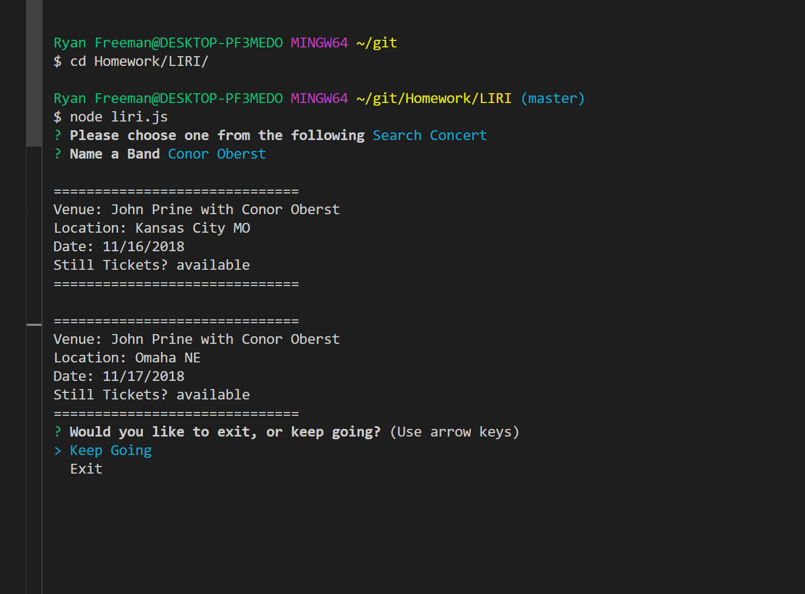

# LIRI
Like SIRI, but 'language' interpretation and recognition interface, rather than 'speech.'

In this assignment, we are tasked with creating a CLI that could do 4 things: 
- Search a song with Spotify 
- Find concert information from Bands in Town 
- Look up movie information 
- Read a command from a text file. 

I decided to make it a little more user friendly by adding some prompts to the user to help them along. I used inquirer to prompt the user for commands and search terms. After you complete a function, you will always get the option to continue using the app, or exit. 

To make this app work, you will need to use npm to install the dependencies from the package.json file. You will need keys for the following APIs:
- Spotify
- Bands in Town
- OMDB 

Please see the screen shots below to see how the application works. 

To start, you get the 4 options. 
- 

Searching for a concert with a band name.
- 

Searching for a song with Spotify.
- ![Search a song]{images/spotify_song.png}

Searching for a movie. 
- (First image shows what happens if you enter the name of a movie that does not exist).
- 
- ![Search with result]{images/movie_result.png}

Searching for a song from a Text File. 
- Here, the app will search what is typed into the random.txt text file. 
- This process could have been DRY'er if I had a little more time. I basicaly coppied code from the Spotify function, rather than finding a way to reuse it. 
-  